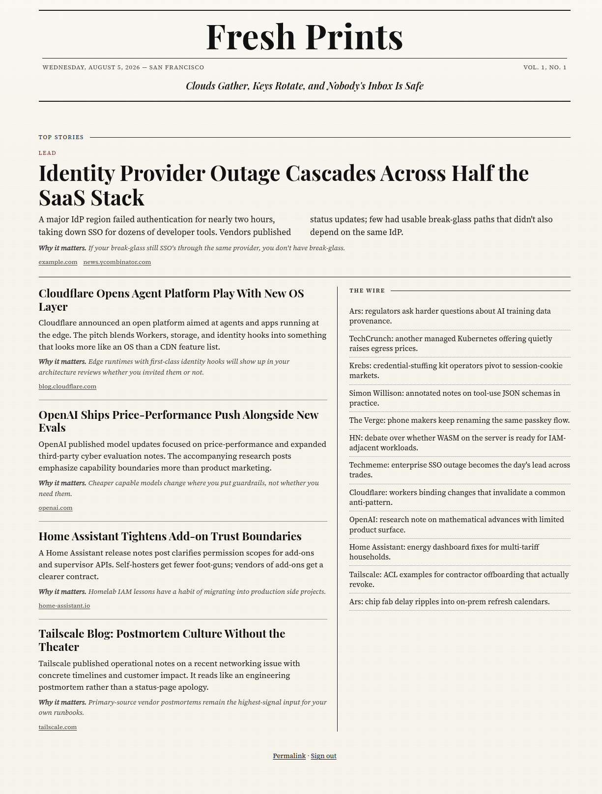
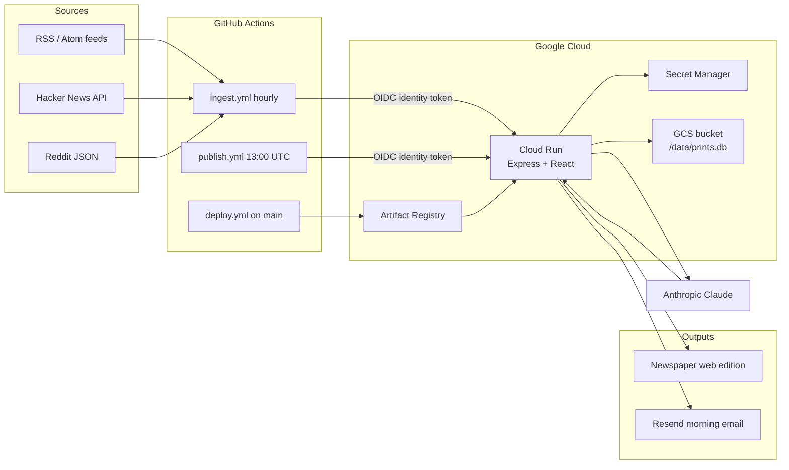

# Fresh Prints

A private, single-user, newspaper-style daily tech digest.

Fresh Prints ingests tech news on an hourly schedule, asks Claude to write a
morning edition, publishes it to a small broadsheet web app, and emails the
same layout to your inbox at 6am Pacific. Auth is GitHub OAuth with a username
allowlist. It deploys to Google Cloud Run via GitHub Actions; SQLite lives on a
GCS volume so every revision stays otherwise-stateless.

> Portfolio piece — this repo is public. Personal emails, project IDs, and
> service URLs live in GitHub Actions variables / GCP Secret Manager, never in
> committed files.



## Architecture



**Request path**

1. `POST /api/ingest` (identity-token protected) pulls enabled rows from
   `sources`, upserts into `items`, then fuzzy-clusters cross-source dupes.
2. `POST /api/publish` loads the last 24h of clusters, calls Claude with
   `prompts/edition.md` + a JSON tool schema, stores an `editions` row
   (idempotent per date), and sends HTML email via Resend.
3. The React app at `/` and `/edition/:date` renders the broadsheet. GitHub
   OAuth (Passport) gates the UI; non-allowlisted users get a 403 page.

## Stack

| Layer | Choice |
|---|---|
| Runtime | Node.js 20, Express (ESM) |
| DB | SQLite via `better-sqlite3` (`DATABASE_URL`) |
| Frontend | React + Vite in `client/` |
| LLM | Anthropic SDK · `claude-sonnet-4-5` |
| Email | Resend |
| Auth | Passport GitHub OAuth + username allowlist |
| Sessions | SQLite via `better-sqlite3` (single-instance store) |
| Jobs auth | GCP identity tokens (`google-auth-library`) |
| Hosting | Cloud Run · max-instances=1 · GCS volume at `/data` |

## Repo layout

```
├── src/                  Express API, ingest, edition builder, auth
├── client/               React newspaper UI
├── prompts/edition.md    Claude ranking + writing prompt (edit freely)
├── .github/workflows/    deploy · ingest · publish
├── Dockerfile            two-stage node:20-alpine
├── SETUP.md              one-time GCP / OAuth / secrets
└── .env.example          every env var documented
```

## Local development

```bash
cp .env.example .env
# fill GH_*, ALLOWED_GITHUB_USERNAMES, ANTHROPIC_API_KEY, RESEND_*, DIGEST_EMAIL_*

npm install
npm install --prefix client
npm run build          # builds client into client/dist
npm run dev            # API on :8080 (serves client/dist)

# optional: Vite HMR on :5173 (proxies /api and /auth)
npm run dev --prefix client
```

Create a GitHub OAuth app **fresh-prints-dev** with callback
`http://localhost:8080/auth/callback`.

In development, `/api/ingest` and `/api/publish` skip identity-token checks:

```bash
curl -X POST http://localhost:8080/api/ingest
curl -X POST http://localhost:8080/api/publish
# optional: {"edition_date":"2026-08-05"}
```

## Production setup

See **[SETUP.md](./SETUP.md)** for the Cloud Shell commands: APIs, Artifact
Registry, deployer SA, secrets (`printf`, never `echo`), GCS bucket, OAuth
apps, and GitHub Actions variables/secrets.

No Actions **secrets** are required — workflows authenticate to GCP via
Workload Identity Federation (keyless).  
Required Actions **variables**: `PROJECT_ID`, `REGION`, `WIF_PROVIDER`,
`WIF_SERVICE_ACCOUNT`, `GH_CLIENT_ID`, `ALLOWED_GITHUB_USERNAMES`,
`ALLOWED_INVOKER_EMAILS`, `DIGEST_EMAIL_TO`, `DIGEST_EMAIL_FROM`, `APP_URL`,
`CLOUD_RUN_SERVICE_URL`

## Security notes (public repo)

- No personal data in committed files.
- No long-lived credentials in GitHub: Actions uses Workload Identity
  Federation (OIDC token exchange, restricted to this repo by an attribute
  condition) instead of exported service-account keys.
- Workflows mask identity tokens with `::add-mask::` before any step that
  could print them; failed job logs do not dump response bodies.
- Cloud Run is `--allow-unauthenticated`; the app enforces GitHub OAuth for
  humans and GCP identity tokens for ingest/publish. Tokens are pinned to a
  caller allowlist (`ALLOWED_INVOKER_EMAILS`, `email_verified` required) —
  audience verification alone would accept a token minted by any service
  account in any project.
- SQLite runs `journal_mode=DELETE` in production: WAL needs shared-memory
  files and real file locking that the GCS FUSE volume doesn't provide.
- `app.set('trust proxy', 1)` is set before session middleware so secure
  cookies work behind Cloud Run's TLS terminator.

## License

[MIT](./LICENSE)
